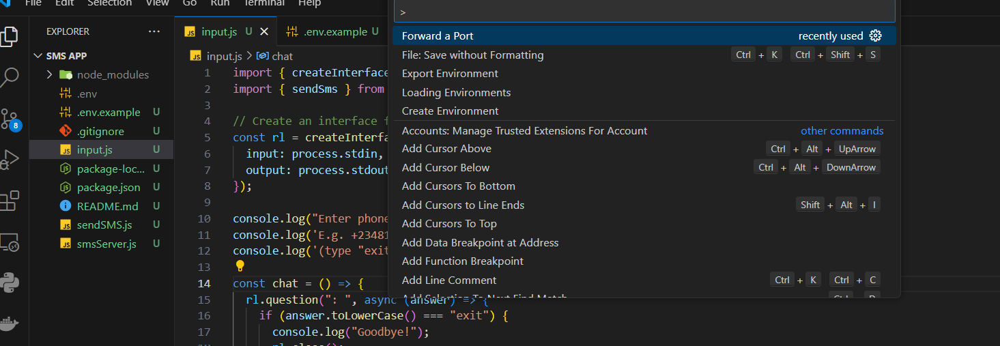
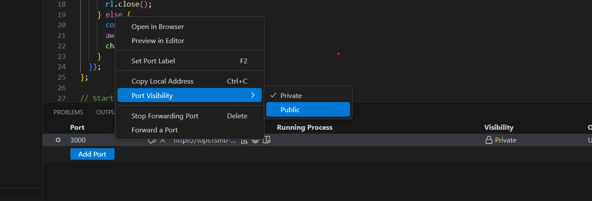
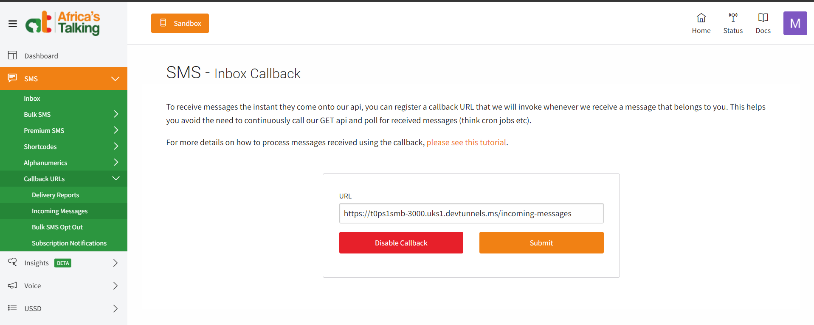
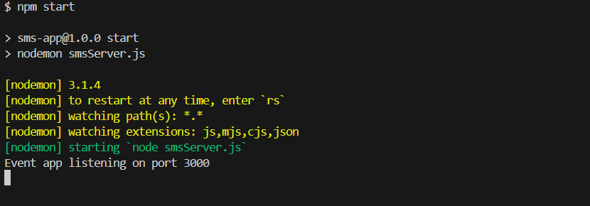
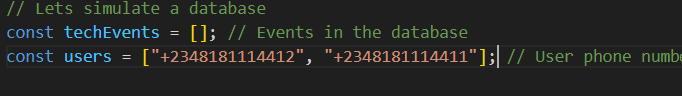
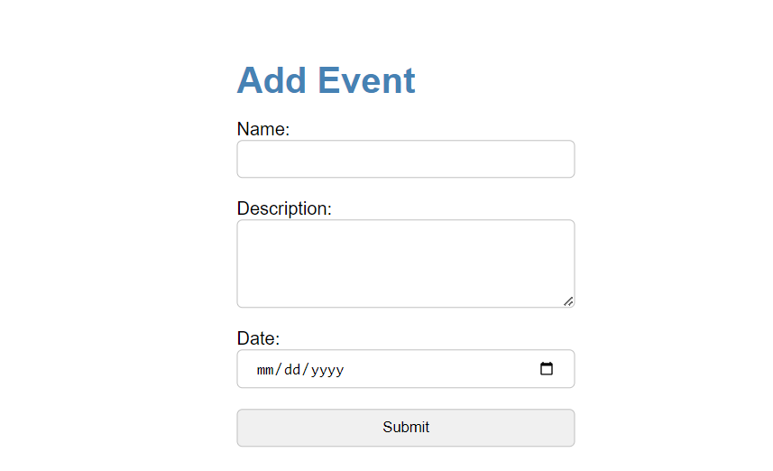
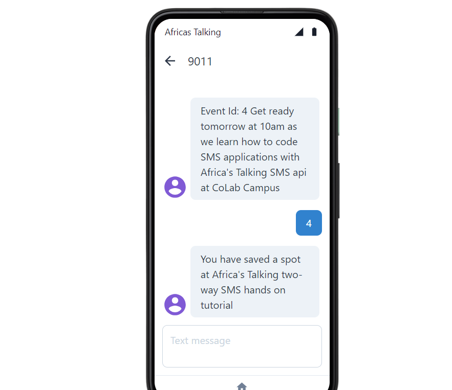

# Two-way SMS example
The following example, is an extension for an event management system written in Node JS. Users will now be up to date on all events.
An SMS is sent to all registered users when ever an event is created. User can send in the Id of the event via SMS to RSVP.

# Tools used
1. africastalking- Africa's Talking SDK.
2. express - For receiving SMS.
3. dotenv - For managing our environment variables.
4. nodemon - To automatically restart our server when we edit any file.

# How to setup and use
Download or clone the repo 

    git clone
Open the project/folder in a code editor.
Rename ".env.example" to ".env" and update its content with your information.

    AT_API_KEY=your_api_key
    AT_USERNAME=sandbox
    AT_NUMBER=your_shortcode

Press `ctrl + shift + p` on your keyboard and search for "Forward port". 

Add a port and make it public

Copy the port address and update your incoming SMS callback [here](https://account.africastalking.com/apps/sandbox/sms/inbox/callback). 
Add `/incoming-messages` at the end of the port address.

run the following in the terminal.

    npm install
    npm start
    

Update the user phone numbers and use the numbers to connect to a simulator (use a new browser tab to connect each number) [here](https://developers.africastalking.com/simulator)

Go to http://localhost:3000 or the port address you got. Add a new event. You should see a new message on the simulators.
Respond to the message with the Id of the event.

